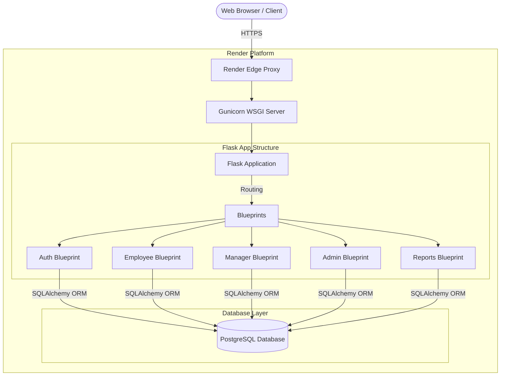

# ATOMQUEST Hackathon Submission

## 1. Live Application URL
**[https://work-management-portal-3.onrender.com/auth/login](https://work-management-portal-3.onrender.com/auth/login)**

## 2. GitHub Repository
**[https://github.com/AnujNayak108/Work_Management_Portal.git](https://github.com/AnujNayak108/Work_Management_Portal.git)**

## 3. Login Credentials (Demo Accounts)
The application has been pre-seeded with demo data so you can test all three roles. You can use the following credentials to explore the different user journeys:

### 👑 Admin Role
- **Email:** `admin@atomberg.com`
- **Password:** `admin123`

### 👔 Manager Role
- **Email:** `manager.eng@atomberg.com` (Engineering Dept)
- **Email:** `manager.mkt@atomberg.com` (Marketing Dept)
- **Email:** `manager.ops@atomberg.com` (Operations Dept)
- **Password:** `manager123`

### 👤 Employee Role
- **Email:** `emp1@atomberg.com` (Engineering)
- **Email:** `emp4@atomberg.com` (Marketing) 
- **Email:** `emp7@atomberg.com` (Operations)
- **Password:** `emp123`

*(Note: There are 9 employee accounts ranging from `emp1@atomberg.com` to `emp9@atomberg.com`, all with the password `emp123`)*

---

## 4. Architecture Diagram

Below is the high-level architecture diagram of the portal. 

